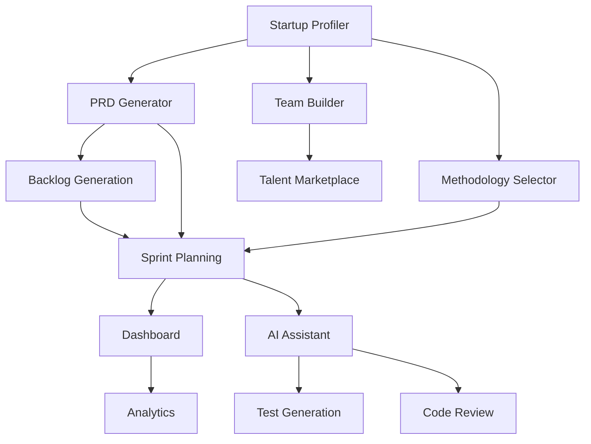

# 🎯 Lista de Features Priorizadas - Framework RICE
## Plataforma SaaS Collybrix

---

## 📊 METODOLOGÍA RICE

### Definición de Criterios

**REACH (Alcance):** ¿Cuántos usuarios/clientes se beneficiarán por trimestre?
- 🔴 Muy Alto: 80-100% de usuarios (10 puntos)
- 🟠 Alto: 60-80% de usuarios (8 puntos)
- 🟡 Medio: 40-60% de usuarios (5 puntos)
- 🟢 Bajo: 20-40% de usuarios (3 puntos)
- ⚪ Muy Bajo: <20% de usuarios (1 punto)

**IMPACT (Impacto):** ¿Cuánto mejora la métrica objetivo?
- 🔴 Masivo: Game changer, diferenciador clave (3 puntos)
- 🟠 Alto: Mejora significativa en KPIs (2 puntos)
- 🟡 Medio: Mejora moderada pero necesaria (1 punto)
- 🟢 Bajo: Nice to have, mejora marginal (0.5 puntos)
- ⚪ Mínimo: Cosmético o edge case (0.25 puntos)

**CONFIDENCE (Confianza):** ¿Qué tan seguros estamos del éxito?
- 🔴 Muy Alta: Validado con usuarios, datos claros (100%)
- 🟠 Alta: Fuerte evidencia, pocos riesgos (80%)
- 🟡 Media: Hipótesis razonable, algunos riesgos (50%)
- 🟢 Baja: Experimental, muchas incógnitas (20%)

**EFFORT (Esfuerzo):** ¿Cuántos person-months requiere?
- 🔴 Muy Alto: >6 person-months
- 🟠 Alto: 3-6 person-months  
- 🟡 Medio: 1-3 person-months
- 🟢 Bajo: 2-4 weeks
- ⚪ Muy Bajo: <2 weeks

**Fórmula RICE Score = (Reach × Impact × Confidence) / Effort**

---

## 🚀 FEATURES PARA MVP (Q1 2026)

### Prioridad 1: Features Críticas (RICE Score > 100)

| # | Feature | Módulo | Reach | Impact | Confidence | Effort | RICE Score | Status |
|---|---------|--------|-------|--------|------------|--------|------------|--------|
| 1 | **Onboarding Conversacional con AI** | Startup Profiler | 10 | 3 | 80% | 1 | **240** | 🔴 Critical |
| 2 | **PRD Generator con Templates** | PRD & Roadmap | 10 | 3 | 80% | 1.5 | **160** | 🔴 Critical |
| 3 | **Dashboard Real-time Básico** | Visibility | 10 | 2 | 100% | 1.5 | **133** | 🔴 Critical |
| 4 | **Sprint Planning Kanban** | Planning Hub | 8 | 3 | 80% | 2 | **96** | 🔴 Critical |
| 5 | **Integración GitHub** | Planning Hub | 8 | 2 | 100% | 1 | **160** | 🔴 Critical |

**Descripción Detallada:**

#### 1. Onboarding Conversacional con AI
- **Descripción:** Chat inteligente que guía al usuario en 15 minutos
- **User Story:** Como fundador, quiero explicar mi startup conversacionalmente para obtener recomendaciones personalizadas
- **Criterios de Éxito:** 80% completion rate, <15 min tiempo promedio
- **Dependencias:** OpenAI API, Base de datos de perfiles
- **Riesgos:** Respuestas AI no relevantes → Mitigación: Templates de fallback

#### 2. PRD Generator con Templates
- **Descripción:** Generación automática de PRD desde conversaciones
- **User Story:** Como fundador, quiero un PRD profesional sin ser técnico
- **Criterios de Éxito:** PRD completo en <30 min, 5+ templates industria
- **Dependencias:** Módulo Profiler completado
- **Riesgos:** PRDs genéricos → Mitigación: Review humano obligatorio

#### 3. Dashboard Real-time Básico
- **Descripción:** Vista unificada de progreso con métricas clave
- **User Story:** Como stakeholder, quiero ver el progreso sin pedir reports
- **Criterios de Éxito:** Updates <1s, 5 métricas core
- **Dependencias:** WebSocket infrastructure
- **Riesgos:** Performance con muchos usuarios → Mitigación: Caching agresivo

---

### Prioridad 2: Features Importantes (RICE Score 50-100)

| # | Feature | Módulo | Reach | Impact | Confidence | Effort | RICE Score | Status |
|---|---------|--------|-------|--------|------------|--------|------------|--------|
| 6 | **Backlog Auto-generation** | Planning Hub | 8 | 2 | 80% | 2 | **64** | 🟠 High |
| 7 | **Team Composition Analyzer** | Team Builder | 8 | 2 | 80% | 2 | **64** | 🟠 High |
| 8 | **Methodology Selector Básico** | Methodology | 5 | 3 | 80% | 2 | **60** | 🟠 High |
| 9 | **Competitor Analysis Tool** | Market Research | 5 | 2 | 100% | 2 | **50** | 🟠 High |
| 10 | **Sprint Velocity Tracking** | Analytics | 8 | 1.5 | 100% | 2 | **60** | 🟠 High |

---

### Prioridad 3: Features Deseables (RICE Score < 50)

| # | Feature | Módulo | Reach | Impact | Confidence | Effort | RICE Score | Status |
|---|---------|--------|-------|--------|------------|--------|------------|--------|
| 11 | **Slack Integration** | Integrations | 5 | 1 | 100% | 1 | **50** | 🟡 Medium |
| 12 | **Email Reports Scheduler** | Analytics | 5 | 1 | 100% | 1 | **50** | 🟡 Medium |
| 13 | **Mobile Dashboard View** | Mobile | 3 | 2 | 50% | 3 | **10** | 🟡 Medium |
| 14 | **Export to PDF** | All Modules | 3 | 0.5 | 100% | 0.5 | **30** | 🟡 Medium |
| 15 | **Dark Mode** | UI/UX | 3 | 0.5 | 100% | 0.5 | **30** | 🟢 Low |

---

## 🎯 FEATURES PARA v0.5 (Q2 2026)

### Prioridad 1: Expansión Core (RICE Score > 80)

| # | Feature | Módulo | Reach | Impact | Confidence | Effort | RICE Score | Status |
|---|---------|--------|-------|--------|------------|--------|------------|--------|
| 16 | **AI Code Generator** | AI Assistant | 10 | 3 | 80% | 3 | **80** | 🔴 Critical |
| 17 | **Talent Marketplace MVP** | Team Builder | 8 | 3 | 50% | 3 | **40** | 🟠 High |
| 18 | **Test Generation Automática** | AI Assistant | 8 | 2 | 80% | 2 | **64** | 🟠 High |
| 19 | **Market Sizing Calculator** | Market Research | 5 | 2 | 100% | 1 | **100** | 🔴 Critical |
| 20 | **PMF Tracking Dashboard** | PMF Validator | 8 | 3 | 50% | 2 | **60** | 🟠 High |

**Descripción Detallada v0.5:**

#### 16. AI Code Generator
- **Descripción:** Generación de código desde user stories
- **Value Prop:** Reduce tiempo de desarrollo 40-60%
- **Tech Stack:** Codex/GPT-4 + Template library
- **Success Metrics:** 70% código usable sin modificaciones mayores

#### 17. Talent Marketplace MVP
- **Descripción:** Pool de developers vetados por Collybrix
- **Value Prop:** Acceso instant a talento senior verificado
- **Tech Stack:** Matching algorithm + Profile database
- **Success Metrics:** 10+ developers activos, 80% match satisfaction

---

## 💎 FEATURES PARA v1.0 (Q3 2026)

### Prioridad 1: Diferenciadores Competitivos

| # | Feature | Módulo | Reach | Impact | Confidence | Effort | RICE Score | Status |
|---|---------|--------|-------|--------|------------|--------|------------|--------|
| 21 | **30+ Metodologías Adaptativas** | Methodology | 10 | 3 | 100% | 4 | **75** | 🔴 Critical |
| 22 | **Predictive Analytics ML** | Analytics | 8 | 3 | 50% | 4 | **30** | 🟠 High |
| 23 | **White-label Platform** | Platform | 3 | 3 | 80% | 6 | **12** | 🟡 Medium |
| 24 | **API Pública v1** | Platform | 5 | 2 | 100% | 3 | **33** | 🟠 High |
| 25 | **Discovery Interview Tools** | Discovery | 5 | 2 | 80% | 2 | **40** | 🟠 High |

---

## 📈 ANÁLISIS POR CATEGORÍAS

### Distribución por Impacto en Métricas

| Categoría | Features | Impacto Principal | RICE Promedio |
|-----------|----------|-------------------|---------------|
| **Acquisition** | Onboarding AI, PRD Generator | Conversión trial → paid | 200 |
| **Activation** | Dashboard, Sprint Planning | Time to first value | 115 |
| **Retention** | AI Assistant, Methodology | Reducir churn | 70 |
| **Revenue** | Marketplace, White-label | Expandir revenue/usuario | 45 |
| **Referral** | Analytics, PMF Tools | NPS y word-of-mouth | 55 |

### Distribución por Esfuerzo de Desarrollo

| Complejidad | # Features | % Total | Person-Months Total |
|-------------|------------|---------|-------------------|
| **Muy Bajo** (<2 weeks) | 3 | 12% | 1.5 |
| **Bajo** (2-4 weeks) | 5 | 20% | 5 |
| **Medio** (1-3 months) | 10 | 40% | 20 |
| **Alto** (3-6 months) | 5 | 20% | 20 |
| **Muy Alto** (>6 months) | 2 | 8% | 14 |

---

## 🚦 MATRIZ DE DEPENDENCIAS

### Dependencias Técnicas Críticas

### Secuencia de Implementación Óptima

**Fase 1 (Mes 1-2):** Foundation
1. Database schema y APIs base
2. Auth y user management
3. Onboarding flow
4. Startup Profiler básico

**Fase 2 (Mes 2-3):** Core Value
1. PRD Generator
2. Dashboard básico
3. Sprint Planning Kanban
4. GitHub integration

**Fase 3 (Mes 3-4):** Enhancement
1. AI Code Assistant
2. Backlog automation
3. Team Builder
4. Analytics básicas

---

## 📊 MÉTRICAS DE VALIDACIÓN

### KPIs por Feature (MVP)

| Feature | Métrica Principal | Target MVP | Target v1.0 |
|---------|------------------|------------|-------------|
| **Onboarding AI** | Completion Rate | >60% | >80% |
| **PRD Generator** | Time to PRD | <30 min | <15 min |
| **Dashboard** | Daily Active Use | >40% | >60% |
| **Sprint Planning** | Stories Completed | >70% | >85% |
| **GitHub Integration** | Repos Connected | >80% | >95% |

### Success Criteria Global

**MVP Success (Q1 2026):**
- ✅ 10 startups activas usando la plataforma
- ✅ NPS > 30
- ✅ 50% de usuarios usan 3+ features
- ✅ Churn < 10% mensual

**v1.0 Success (Q3 2026):**
- ✅ 50 startups activas
- ✅ €50K MRR
- ✅ NPS > 50
- ✅ Churn < 5% mensual
- ✅ 2+ partnerships con aceleradoras

---

## 🎯 QUICK WINS (Implementar YA)

### Top 5 Features para Máximo ROI

| Feature | Effort (días) | Impact | Por qué ahora |
|---------|--------------|--------|---------------|
| **1. Landing Page con Waitlist** | 3 | Alto | Capturar leads mientras desarrollamos |
| **2. Onboarding Questionnaire** | 5 | Alto | Validar assumptions con early adopters |
| **3. PRD Template Library** | 7 | Alto | Valor inmediato sin tech compleja |
| **4. Slack Community** | 2 | Medio | Engagement y feedback loop |
| **5. Demo Video Interactivo** | 5 | Alto | Reducir CAC y educar mercado |

---

## 📋 BACKLOG DE FEATURES FUTURAS (Post v1.0)

### Innovación y Diferenciación

| Feature | Potencial | Complejidad | Timeline |
|---------|-----------|-------------|----------|
| **AI Agents Autónomos** | Revolutionary | Muy Alta | 2027 |
| **Blockchain Milestones** | Diferenciador | Alta | Q4 2026 |
| **Mobile Native Apps** | Expansión | Media | Q4 2026 |
| **Voice-controlled Planning** | Innovation | Alta | 2027 |
| **VR Collaboration Spaces** | Futurista | Muy Alta | 2028 |

### Expansión de Mercado

| Feature | Mercado Target | Revenue Impact | Priority |
|---------|---------------|----------------|----------|
| **Multi-language Support** | LATAM/EU | +40% TAM | High |
| **Enterprise Features** | Scale-ups | +60% ACV | Medium |
| **Education Platform** | Universities | New vertical | Low |
| **Certification Program** | Developers | New revenue | Medium |

---

## 🔄 PROCESO DE PRIORIZACIÓN CONTINUA

### Review Quincenal de Prioridades

**Inputs:**
1. User feedback (NPS, support tickets)
2. Usage analytics (feature adoption)
3. Competitive intelligence
4. Technical debt assessment
5. Business metrics (MRR, churn)

**Proceso:**
1. **Lunes Semana 1:** Recolección de datos
2. **Martes Semana 1:** Scoring RICE actualizado
3. **Miércoles Semana 1:** Review con stakeholders
4. **Jueves Semana 1:** Decisión y comunicación
5. **Viernes Semana 1:** Update roadmap público

### Criterios de Re-priorización

**Subir prioridad si:**
- User feedback consistente (>5 requests)
- Blocker para deals grandes (>€5K MRR)
- Quick win identificado (<1 semana, alto impacto)
- Ventaja competitiva temporal

**Bajar prioridad si:**
- Complejidad técnica mayor a estimada
- Dependencias no resueltas
- Menor adopción esperada en analytics
- Alternativa más simple identificada

---

## 📊 RESUMEN EJECUTIVO

### Investment Required por Fase

| Fase | Features Core | Tiempo | Team Size | Costo Est. |
|------|--------------|---------|-----------|------------|
| **MVP** | 5 críticas + 5 importantes | 3 meses | 3-4 devs | €45-60K |
| **v0.5** | +5 expansión core | 3 meses | 4-5 devs | €60-75K |
| **v1.0** | +5 diferenciadores | 3 meses | 5-6 devs | €75-90K |
| **TOTAL** | 25 features core | 9 meses | - | €180-225K |

### ROI Proyectado

**Break-even:** Mes 8-10 post-launch
**Payback período:** 12-14 meses
**ROI Year 1:** 150-200%
**ROI Year 2:** 400-500%

### Riesgos Principales

1. **Adopción más lenta:** Mitigar con freemium
2. **Competencia acelera:** Mitigar con partnerships
3. **AI costs explotan:** Mitigar con caching y optimización
4. **Technical debt:** Mitigar con 20% tiempo en refactor

---

## 🎬 PRÓXIMOS PASOS INMEDIATOS

### Semana 1-2
✅ Validar priorización con 5 clientes actuales  
✅ Confirmar tech stack con equipo  
✅ Setup ambiente desarrollo  
✅ Crear landing con waitlist  

### Semana 3-4
✅ Desarrollar Onboarding flow  
✅ MVP del Startup Profiler  
✅ Integrar OpenAI API  
✅ Primeros user tests  

### Mes 2
✅ PRD Generator funcional  
✅ Dashboard básico  
✅ 10 early adopters testing  
✅ Iterar basado en feedback  

---

**Documento elaborado por:** Equipo Producto Collybrix  
**Versión:** 1.0  
**Fecha:** Enero 2025  
**Próxima revisión:** Post-feedback early adopters (Febrero 2025)  
**Metodología:** RICE Framework adaptado para B2B SaaS
